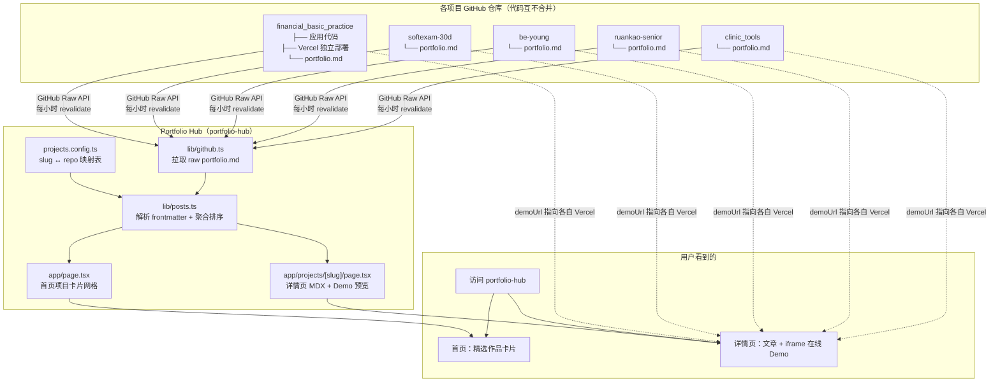
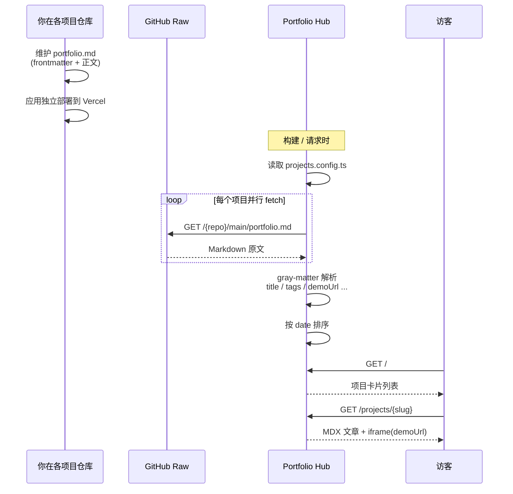
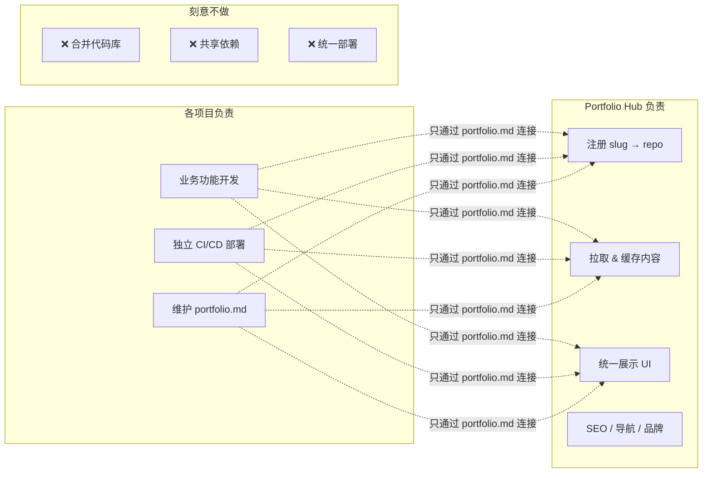
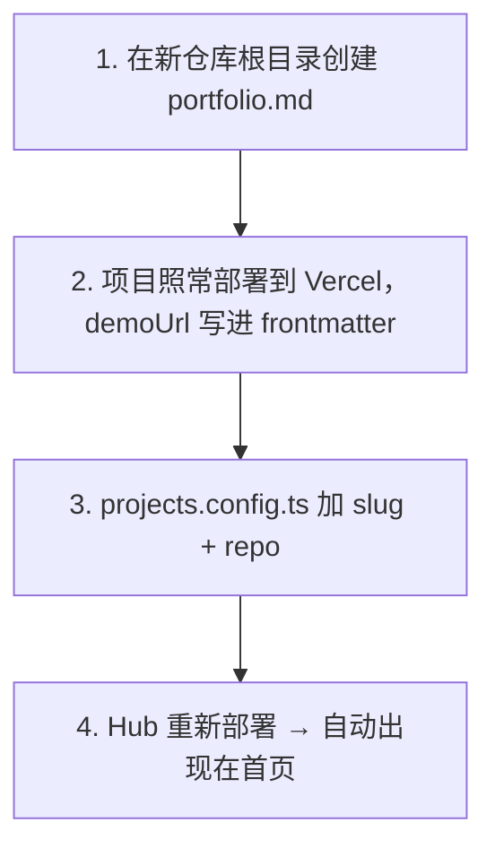

# Portfolio Hub 多项目聚合架构

> 核心思路：**各项目代码独立、各自部署，只通过 `portfolio.md` 契约 + 中心 Hub 聚合展示**——不是把代码合并进一个 monorepo。

---

## 整体架构：Hub + Spoke（联邦式聚合）



---

## 数据流：从配置到页面



---

## 各层职责划分



---

## `portfolio.md` 契约（唯一的「合并协议」）

每个项目仓库根目录放同一个格式的文件，Hub 只认这一份：

```yaml
---
title: "项目名"
description: "一句话介绍"
tags: ["Next.js", "TypeScript"]
thumbnail: "/thumbnails/xxx.png"
demoUrl: "https://xxx.vercel.app/"    # 各自独立部署地址
githubUrl: "https://github.com/Bovia/xxx"
date: "2024-03"
---

## 为什么做这个
正文 Markdown，Hub 用 MDX 渲染
```

Hub 侧注册只需在 `projects.config.ts` 加一条：

```typescript
{
  slug: "my-new-project",
  repo: "Bovia/my-new-project",
  // branch: "main",  // 可选，默认 main
}
```

---

## 新增项目流程



---

## 关键代码路径

| 文件 | 职责 |
|------|------|
| `projects.config.ts` | 项目注册表：slug ↔ GitHub repo |
| `lib/github.ts` | 从 GitHub Raw 拉取 `portfolio.md`，1 小时 revalidate |
| `lib/posts.ts` | 并行 fetch 所有项目，解析 frontmatter，按 date 排序 |
| `app/page.tsx` | 首页 Hero + 项目卡片网格 |
| `app/projects/[slug]/page.tsx` | 详情页：MDX 正文 + iframe Demo 预览 |
| `components/ProjectCard.tsx` | 首页卡片组件 |
| `components/MDXWrapper.tsx` | Markdown 正文渲染 |

---

## 设计要点总结

| 维度 | 策略 |
|------|------|
| **代码** | 各仓库完全独立，零侵入 |
| **部署** | 每个项目各自 Vercel；Hub 只做展示层 |
| **内容同步** | GitHub Raw 拉取 `portfolio.md`，1 小时缓存 |
| **扩展成本** | 新项目 = 1 个 md 文件 + 1 行 config |
| **展示** | 首页卡片 → 详情页（故事 + iframe 实时 Demo） |

---

## 一句话总结

不是把多个项目「揉」成一个仓库，而是用一个轻量 Hub 把分散在各处的「作品说明书 + 在线 Demo」统一呈现。
